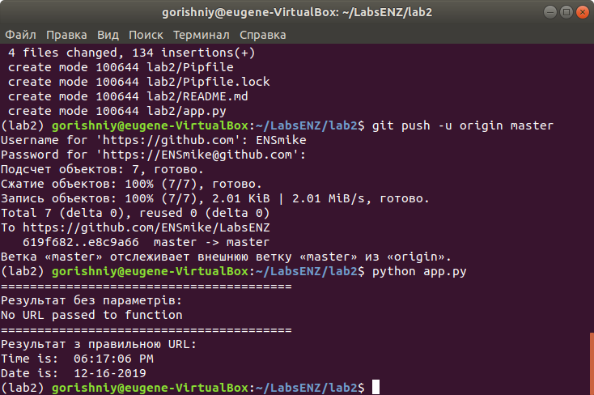
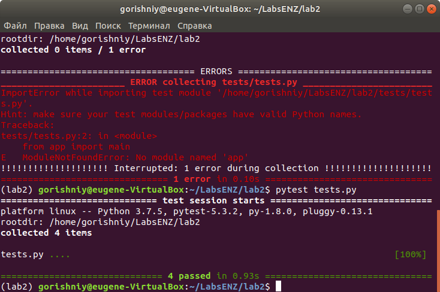

**Labs**
========

1. Встановив pipenv та бiблiотеки requests та ntplib.
2. Перевiрив працездатнiсть файлу app.py

3. Створив файл tests та скопiював його код з репозиторiю.
4. Переконався що тести проводяться успiшно.

