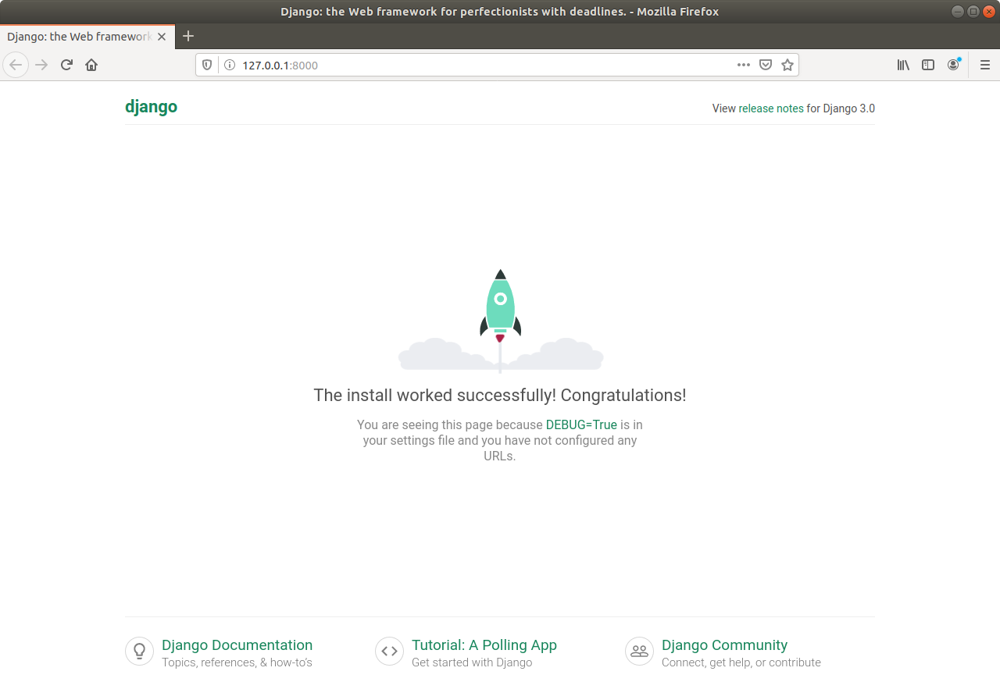

**Labs**
========

1. Iнiцiалiзував середовище pipenv в створенiй папцi лабораторноi.
2. За допомогою команди **pipenv install django** встановив фреймворк django.
3. Налаштував структуру проекту згiдно з завданням.
4. Запустив сервер та переконався що вiн працюе корректно.

